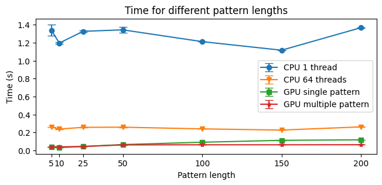

# Exact-Matching-on-GPUs-KMP-algorithm

In this repository, you will find four different CUDA implementations of the Knuth-Morris-Pratt algorithm for exact string matching. In all implementations, a random string (or more) is sampled from the input text and an output will be given in the form of a boolean array, where a 1 indicates that a pattern was found starting at that position in the text. As the results are not the main point of this repository, the code that writes the output to a file has been put in a comment, but it can be easily uncommented. 

To compile and run the code, you must have the CUDA toolkit installed on your machine. The commands to compile and run the code are as follows:

```c++
nvcc -o executable_name source_code.cu // compile the code
./executable_name input_text_file // run the code
```

The four implementations are as follows:
- **cpu_single_thread.cu**: A CPU implementation that uses a single thread to search for the pattern in the text.
- **cpu_multiple_threads.cu**: A CPU implementation that uses multiple threads (64 in this case) to search for the pattern in the text.
- **gpu_single_pattern.cu**: A GPU implementation that uses multiple threads and streams to search for the pattern in the text.
- **gpu_multiple_patterns.cu**: A GPU implementation that uses multiple threads and streams to search for multiple (4 in this case) patterns in the text.

All execution parameters are defined at the beginning of each file, so you must change them according to your needs and recompile the code accordingly.

The following are the time results that I found on my machine: an ASUS Vivobook Pro 15 N580VD with an NVIDIA GeForce GTX 1050 GPU and an Intel Core i7-7700HQ CPU. All tests have been executed on the file *Homo sapiens.GRCh38.dna.alt.fa* found at [this link](https://www.ensembl.org/info/data/ftp/index.html).

***Result time per pattern:***
|Algorithm/Pattern length| 5 | 10 | 25|50 |100 |150 |200 | 
|---|---|---|---|---|---|---|---|
| CPU single thread  |  1.33836 | 1.19628 | 1.32696 | 1.34339 |  1.21205 | 1.11639 | 1.36769 |
| CPU 64 threads | 0.25941 | 0.23736 | 0.25656 | 0.25819 | 0.23941 | 0.22608 | 0.26163| 
| GPU single pattern | 0.03671 | 0.03058 | 0.04318 | 0.06418 | 0.09063 | 0.11157 | 0.11739|
| GPU multiple patterns | 0.04028 | 0.03869 | 0.04307 | 0.06081 | 0.06196 | 0.06196 | 0.06261|


***Standard deviation on previous results:***
|Algorithm/Pattern length| 5 | 10 | 25|50 |100 |150 |200 | 
|---|---|---|---|---|---|---|---|
|CPU single thread | 0.06221| 0.01129| 0.01279| 0.03224|  0.00882| 0.01187| 0.01475 |
| CPU 64 threads|  0.00211| 0.00214| 0.00188| 0.00238|  0.00131| 0.00129| 0.00224|
| GPU single pattern|  0.00029| 0.00067| 0.00024| 0.00049|  0.00021| 0.00042| 0.00039|
| GPU multiple patterns|  0.00025| 0.00047| 0.00032| 0.00023|  0.00036| 0.00049| 0.00029|

***Result time visualization:***


